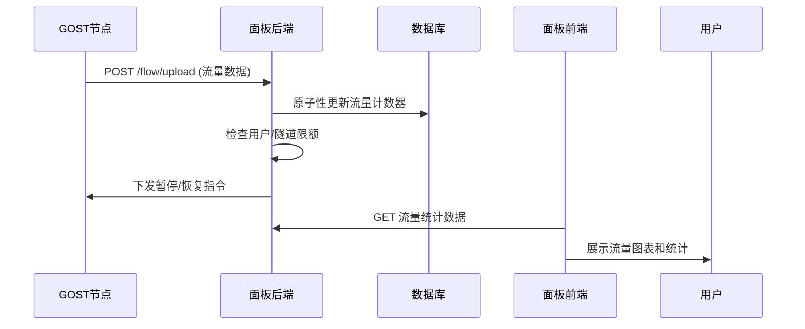

# CLAUDE.md

This file provides guidance to Claude Code (claude.ai/code) when working with code in this repository.

## 项目概述

flux-panel 是一个基于 GOST 的代理管理系统，采用前后端分离架构。系统提供了完整的节点管理、流量转发、用户权限控制和实时监控功能。

## 技术架构

### 前端架构 (vite-frontend/)
- **框架**: React 18.3.1 + TypeScript 5.6.3
- **构建工具**: Vite 5.4.11
- **UI框架**: HeroUI v2 (基于 Tailwind CSS)
- **路由管理**: React Router DOM 6.23.0
- **HTTP客户端**: Axios 1.11.0
- **图表组件**: Recharts 3.1.1
- **通知系统**: React Hot Toast + Sonner
- **状态管理**: React Hooks + Context API

### 后端架构 (springboot-backend/)
- **框架**: Spring Boot 2.7.18
- **语言版本**: Java 21
- **ORM框架**: MyBatis-Plus 3.4.1
- **数据库**: MySQL 5.7+
- **认证方式**: JWT Token
- **工具库**: Hutool、Apache Commons Lang、FastJSON
- **验证码**: tianai-captcha
- **实时通信**: WebSocket

### GOST代理服务 (go-gost/)
- **语言**: Go 1.21+
- **核心功能**: 多协议代理转发 (TCP/UDP/HTTP/SOCKS/TLS)
- **通信方式**: WebSocket长连接 + HTTP接口
- **配置管理**: 动态配置加载和热更新
- **流量统计**: 实时流量监控和上报
- **加密支持**: AES加密通信

## 项目结构详解

### 前端目录结构
```
vite-frontend/
├── src/
│   ├── api/              # API接口封装
│   │   ├── index.ts      # 业务API接口定义
│   │   └── network.ts    # HTTP客户端配置
│   ├── components/       # 通用组件
│   │   ├── navbar.tsx    # 导航栏组件
│   │   ├── primitives.ts # UI基础组件
│   │   └── theme-switch.tsx # 主题切换
│   ├── config/           # 配置文件
│   │   └── site.ts       # 站点配置
│   ├── layouts/          # 布局组件
│   │   ├── admin.tsx     # 管理员布局
│   │   ├── default.tsx   # 默认布局
│   │   ├── h5.tsx        # 移动端布局
│   │   └── h5-simple.tsx # 移动端简化布局
│   ├── pages/            # 页面组件
│   │   ├── dashboard.tsx # 仪表板页面
│   │   ├── forward.tsx   # 转发管理
│   │   ├── tunnel.tsx    # 隧道管理
│   │   ├── node.tsx      # 节点管理
│   │   ├── user.tsx      # 用户管理
│   │   ├── profile.tsx   # 用户配置
│   │   ├── index.tsx     # 登录页面
│   │   └── config.tsx    # 系统配置
│   ├── types/            # TypeScript类型定义
│   └── utils/            # 工具函数
│       ├── logout.ts     # 登出工具
│       └── panel.ts      # 面板工具函数
├── nginx.conf           # Nginx配置文件
└── Dockerfile          # Docker构建文件
```

### 后端目录结构
```
springboot-backend/
├── src/main/java/com/admin/
│   ├── controller/          # 控制器层
│   │   ├── FlowController.java      # 流量统计控制器 ⭐
│   │   ├── ForwardController.java   # 转发管理控制器
│   │   ├── TunnelController.java    # 隧道管理控制器
│   │   ├── NodeController.java      # 节点管理控制器
│   │   ├── UserController.java      # 用户管理控制器
│   │   └── OpenApiController.java   # 开放API控制器
│   ├── service/             # 服务层接口
│   │   └── impl/             # 服务层实现
│   │       ├── FlowServiceImpl.java     # 流量服务实现
│   │       ├── ForwardServiceImpl.java  # 转发服务实现
│   │       ├── TunnelServiceImpl.java   # 隧道服务实现
│   │       ├── NodeServiceImpl.java     # 节点服务实现
│   │       └── UserServiceImpl.java     # 用户服务实现
│   ├── mapper/              # 数据访问层
│   ├── entity/              # 实体类
│   │   ├── User.java        # 用户实体
│   │   ├── Node.java        # 节点实体
│   │   ├── Tunnel.java      # 隧道实体
│   │   ├── Forward.java     # 转发实体
│   │   └── UserTunnel.java  # 用户隧道权限实体
│   ├── common/              # 公共组件
│   │   ├── aop/             # AOP切面
│   │   ├── dto/             # 数据传输对象
│   │   ├── lang/            # 响应封装
│   │   ├── task/            # 异步任务
│   │   └── utils/           # 工具类
│   └── config/              # 配置类
└── src/main/resources/
    ├── application.yml      # Spring Boot配置
    └── mapper/              # MyBatis XML映射文件
```

### GOST服务结构
```
go-gost/
├── main.go                  # 主程序入口
├── config.go               # 配置文件处理
├── register.go             # 组件注册
├── x/
│   ├── service/
│   │   ├── service.go          # 核心服务逻辑
│   │   └── traffic_reporter.go # 流量上报模块 ⭐
│   ├── socket/
│   │   └── websocket_reporter.go # WebSocket通信 ⭐
│   ├── config/             # 配置解析
│   ├── handler/            # 协议处理器
│   ├── listener/           # 监听器组件
│   └── limiter/            # 流量限制器
└── config.json             # 运行时配置文件
```

## 核心功能模块详解

### 1. 用户权限管理体系
#### 角色体系
- **管理员** (role_id=0): 系统最高权限，管理所有资源
- **普通用户** (role_id>0): 受限权限，仅管理自己的转发

#### 权限控制机制
```java
// 后端权限验证示例 (BaseController.java)
protected void requireAdmin() {
    if (!isAdmin()) {
        throw new SecurityException("需要管理员权限");
    }
}

// 前端路由保护 (App.tsx)
<ProtectedRoute>
  <Route path="/admin/*" element={<AdminLayout />} />
</ProtectedRoute>
```

#### 用户限制策略
- **流量限额**: 每用户总流量上限 (user.flow * 1GB)
- **转发数量**: 最大转发数量限制 (user.num)
- **到期控制**: 账户有效期管理 (user.exp_time)
- **隧道权限**: 通过 user_tunnel 表控制隧道访问权限

### 2. 流量统计与监控系统 ⭐核心模块

#### 流量上报流程


#### 流量数据结构
```json
// GOST上报的流量数据格式
{
  "n": "forwardId_userId_userTunnelId",  // 服务标识
  "u": 1024000,                          // 上行流量(字节)
  "d": 2048000                           // 下行流量(字节)
}
```

#### 并发安全机制
```java
// FlowController.java - 并发安全的流量更新
private void updateUserFlow(String userId, FlowDto flowStats) {
    synchronized (getUserLock(userId)) {
        UpdateWrapper<User> updateWrapper = new UpdateWrapper<>();
        updateWrapper.eq("id", userId);
        updateWrapper.setSql("in_flow = in_flow + " + flowStats.getD());
        updateWrapper.setSql("out_flow = out_flow + " + flowStats.getU());
        userService.update(null, updateWrapper);
    }
}
```

#### 流量计费规则
- **流量倍率**: 支持tunnel.traffic_ratio自定义计费比例
- **计费方向**: 
  - `tunnel.flow = 1`: 仅入站流量计费
  - `tunnel.flow = 2`: 双向流量计费 (默认)

### 3. 节点管理与配置同步

#### 节点注册流程
1. **密钥生成**: 创建节点时生成唯一secret
2. **配置下发**: 生成节点安装命令
3. **连接建立**: GOST节点通过WebSocket连接面板
4. **配置同步**: 实时同步服务配置到节点

#### 安装命令生成
```java
// NodeServiceImpl.java - 构建安装命令
private R buildInstallCommand(Node node) {
    StringBuilder command = new StringBuilder();
    command.append("curl -L https://raw.githubusercontent.com/mobosang/flux-panel/refs/heads/main/install.sh")
           .append(" -o ./install.sh && chmod +x ./install.sh && ");
    command.append("./install.sh")
           .append(" -a ").append(processedServerAddr)
           .append(" -s ").append(node.getSecret());
    return R.ok(command.toString());
}
```

### 4. 转发与隧道管理

#### 数据关系
```
User (1) ──→ (N) Forward ──→ (1) Tunnel ──→ (1) Node(入口/出口)
  │                              │
  └─── (M:N) UserTunnel ────────┘
```

#### 转发配置
- **入口配置**: `forward.in_port` 监听端口
- **出口配置**: `forward.out_port` + `forward.remote_addr` 目标地址
- **协议支持**: TCP、UDP、HTTP、SOCKS等多协议
- **流量统计**: 每个转发独立的流量计数器

### 5. Docker部署架构

#### 服务编排 (docker-compose-v4.yml)
```yaml
version: '3.8'
services:
  mysql:
    image: mysql:5.7
    networks:
      - gost-network
    volumes:
      - mysql_data:/var/lib/mysql
      
  backend:
    image: jjjjmo/springboot-backend:latest
    depends_on: [mysql]
    networks:
      - gost-network
      
  frontend:
    image: jjjjmo/vite-frontend:latest
    depends_on: [backend]
    networks:
      - gost-network
    ports:
      - "${HOST_PORT}:80"

networks:
  gost-network:
    driver: bridge
    ipam:
      config:
        - subnet: 172.20.0.0/16
```

#### Nginx反向代理配置
```nginx
# 前端静态文件服务
location / {
    try_files $uri $uri/ /index.html;
}

# API接口代理
location ^~ /api/v1/ {
    proxy_pass http://backend:6365/api/v1/;
}

# 流量上报接口代理 (修复的关键配置)
location ^~ /flow/ {
    proxy_pass http://backend:6365/flow/;
}

# WebSocket代理
location /system-info {
    proxy_pass http://backend:6365/system-info;
    proxy_http_version 1.1;
    proxy_set_header Upgrade $http_upgrade;
    proxy_set_header Connection "upgrade";
}
```

## 数据库设计

### 核心表结构

#### 用户表 (user)
```sql
CREATE TABLE user (
    id INT PRIMARY KEY AUTO_INCREMENT,
    user VARCHAR(50) NOT NULL UNIQUE,      -- 用户名
    pwd VARCHAR(255) NOT NULL,             -- 密码(MD5)
    role_id INT DEFAULT 1,                 -- 角色ID(0=管理员)
    exp_time BIGINT,                       -- 到期时间(时间戳)
    flow INT DEFAULT 0,                    -- 流量限额(GB)
    in_flow BIGINT DEFAULT 0,              -- 入站流量统计(字节)
    out_flow BIGINT DEFAULT 0,             -- 出站流量统计(字节)
    num INT DEFAULT 5,                     -- 最大转发数量
    status INT DEFAULT 1,                  -- 状态(1=正常,0=禁用)
    created_time BIGINT,                   -- 创建时间
    updated_time BIGINT                    -- 更新时间
);
```

#### 节点表 (node)
```sql
CREATE TABLE node (
    id INT PRIMARY KEY AUTO_INCREMENT,
    name VARCHAR(100) NOT NULL,            -- 节点名称
    secret VARCHAR(255) NOT NULL UNIQUE,   -- 节点密钥
    ip TEXT,                               -- 节点IP列表
    server_ip VARCHAR(100),                -- 服务器IP
    port_sta INT,                          -- 端口范围开始
    port_end INT,                          -- 端口范围结束
    status INT DEFAULT 1,                  -- 状态
    created_time BIGINT,
    updated_time BIGINT
);
```

#### 隧道表 (tunnel)
```sql
CREATE TABLE tunnel (
    id INT PRIMARY KEY AUTO_INCREMENT,
    name VARCHAR(100) NOT NULL,            -- 隧道名称
    traffic_ratio DECIMAL(10,2) DEFAULT 1.00, -- 流量计费比例
    type INT DEFAULT 1,                    -- 类型(1=本地,2=远程)
    protocol VARCHAR(20) DEFAULT 'tcp',    -- 传输协议
    flow INT DEFAULT 2,                    -- 计费方向(1=单向,2=双向)
    in_node_id INT,                        -- 入口节点ID
    out_node_id INT,                       -- 出口节点ID
    status INT DEFAULT 1,
    created_time BIGINT,
    updated_time BIGINT
);
```

#### 转发表 (forward)
```sql
CREATE TABLE forward (
    id INT PRIMARY KEY AUTO_INCREMENT,
    user_id INT NOT NULL,                  -- 用户ID
    tunnel_id INT NOT NULL,                -- 隧道ID
    in_port INT NOT NULL,                  -- 监听端口
    out_port INT,                          -- 目标端口
    remote_addr VARCHAR(255),              -- 目标地址
    in_flow BIGINT DEFAULT 0,              -- 入站流量统计
    out_flow BIGINT DEFAULT 0,             -- 出站流量统计
    status INT DEFAULT 1,
    created_time BIGINT,
    updated_time BIGINT,
    FOREIGN KEY (user_id) REFERENCES user(id),
    FOREIGN KEY (tunnel_id) REFERENCES tunnel(id)
);
```

#### 用户隧道权限表 (user_tunnel)
```sql
CREATE TABLE user_tunnel (
    id INT PRIMARY KEY AUTO_INCREMENT,
    user_id INT NOT NULL,                  -- 用户ID
    tunnel_id INT NOT NULL,                -- 隧道ID
    flow BIGINT DEFAULT 0,                 -- 隧道流量限额(GB)
    in_flow BIGINT DEFAULT 0,              -- 入站流量统计
    out_flow BIGINT DEFAULT 0,             -- 出站流量统计
    exp_time BIGINT,                       -- 权限到期时间
    status INT DEFAULT 1,                  -- 状态
    created_time BIGINT,
    updated_time BIGINT,
    UNIQUE KEY uk_user_tunnel (user_id, tunnel_id)
);
```

## API接口文档

### 认证相关
- `POST /api/v1/user/login` - 用户登录
- `POST /api/v1/user/logout` - 用户登出
- `GET /api/v1/user/info` - 获取用户信息

### 流量统计 ⭐核心接口
- `POST /flow/upload?secret={nodeSecret}` - 节点流量数据上报
- `POST /flow/config?secret={nodeSecret}` - 节点配置同步
- `GET /api/v1/flow/stats` - 获取流量统计数据

### 管理接口
- `GET /api/v1/forward/list` - 获取转发列表
- `POST /api/v1/forward/create` - 创建转发规则
- `PUT /api/v1/forward/{id}` - 更新转发规则
- `DELETE /api/v1/forward/{id}` - 删除转发规则

### 节点管理
- `GET /api/v1/node/list` - 获取节点列表
- `POST /api/v1/node/create` - 创建节点
- `GET /api/v1/node/{id}/install` - 获取节点安装命令

## 开发环境配置

### 前端开发
```bash
cd vite-frontend
npm install              # 安装依赖
npm run dev              # 启动开发服务器 (http://localhost:5173)
npm run build            # 构建生产版本
npm run lint             # 代码检查
npm run preview          # 预览生产构建
```

### 后端开发
```bash
cd springboot-backend
mvn clean install        # 安装依赖并构建
mvn spring-boot:run      # 启动应用 (http://localhost:6365)
mvn test                 # 运行测试
mvn package              # 打包JAR文件
```

### Docker部署
```bash
# 拉取最新镜像
docker-compose pull

# 启动所有服务
docker-compose up -d

# 查看服务状态
docker-compose ps

# 查看服务日志
docker-compose logs -f backend
```

### GOST节点部署
```bash
# 下载安装脚本
curl -L https://raw.githubusercontent.com/mobosang/flux-panel/refs/heads/main/install.sh -o install.sh

# 赋予执行权限
chmod +x install.sh

# 执行安装 (替换为实际的面板地址和节点密钥)
./install.sh -a panel.example.com:6366 -s your-node-secret
```

## 故障排除指南

### 流量统计为0的问题
1. **检查nginx配置**: 确保 `/flow/` 路径正确代理到后端
2. **验证节点连接**: 检查GOST节点与面板的WebSocket连接
3. **查看上报日志**: 检查GOST节点的流量上报日志
4. **数据库连接**: 确认后端能正常连接MySQL数据库

### 节点连接失败
1. **网络连通性**: 测试节点到面板的网络连通性
2. **防火墙设置**: 检查防火墙是否阻挡WebSocket连接
3. **配置文件**: 验证节点config.json配置正确性
4. **SSL证书**: 如使用HTTPS，检查SSL证书配置

### 前端白屏问题
1. **JavaScript错误**: 检查浏览器控制台错误信息
2. **API连接**: 确认前端能正常调用后端API
3. **路由配置**: 检查React Router配置是否正确
4. **构建配置**: 验证Vite构建配置和环境变量

## 安全注意事项

### 认证安全
- JWT Token过期时间合理设置
- 密码采用MD5加密存储
- 支持验证码防暴力破解
- 角色权限严格验证

### 网络安全
- CORS跨域访问控制
- WebSocket连接认证
- 节点间通信加密 (AES)
- SQL注入防护 (MyBatis参数绑定)

### 数据安全
- 敏感配置环境变量化
- 数据库连接池配置
- 日志脱敏处理
- 定期数据备份

## 版本历史

- **v1.2.0**: 修复nginx流量上报代理配置，解决流量统计为0的问题
- **v1.1.0**: 优化前端UI体验，支持移动端自适应
- **v1.0.0**: 初始版本发布，包含完整的面板管理功能

---
*本文档基于 Claude Code 自动分析生成，详细记录了 flux-panel 项目的完整架构和开发指南。*